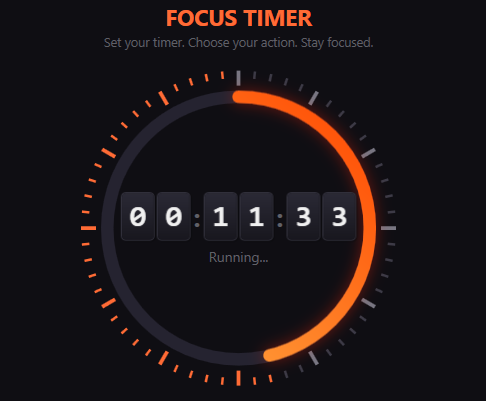

# ⏱️ Focus Hypermode Timer

> A modern, distraction-free productivity timer for Windows, built with PowerShell and WPF.



## 🚀 Features

- **Modern Dark UI**: Sleek `#12111A` background with neon orange accents.
- **Flip Clock Animation**: Retro-mechanical style countdown with satisfying flip effects.
- **Visual Progress Ring**: Circular gradient indicator (`#FFB347` → `#FF4500`) that tracks elapsed time.
- **Hypermode**: optional fullscreen kiosk mode that blocks distractions and keeps you focused.
- **System Actions**:
  - 🚪 **Logout**: Automatically log out when time expires.
  - 🛑 **Shutdown**: Turn off PC after the session.
  - 🔔 **Notify**: Simple audio alert.
- **Presets**: Quick-set buttons (e.g., 15 min, 45 min).

## 📦 Installation

1. Download the latest **`Timer.exe`** from the [Releases](#) tab (or compile it yourself).
2. Run `Timer.exe`. No installation required.

## 🛠️ Build from Source

You can customize and compile the timer yourself using PowerShell.

### Prerequisites
- Windows 10/11
- PowerShell 5.1+
- `ps2exe` module (for compilation) `Install-Module ps2exe`

### Steps
1. Clone the repository:
   ```powershell
   git clone https://github.com/yourusername/focus-timer.git
   cd focus-timer
   ```
2. (Optional) Customize the icon:
   ```powershell
   ./GenerateIcon.ps1
   ./ConvertToIco.ps1
   ```
3. Compile to `.exe`:
   ```powershell
   Invoke-PS2EXE -InputFile "Timer.ps1" -OutputFile "Timer.exe" -IconFile "icon.ico" -noConsole
   ```

## 🎨 Technology Stack

- **Language**: PowerShell (Presentation Framework via WPF XAML)
- **UI**: Windows Presentation Foundation (WPF)
- **Styling**: XAML Resources, Gradients, Effects (DropShadow, Blur)
- **Assets**: Programmatically generated vector icons via `System.Drawing`.

## 📄 License

MIT License. Free to use and modify.
